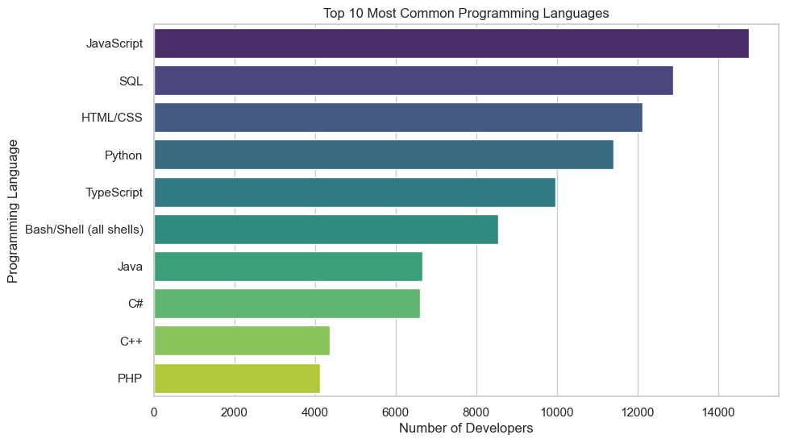
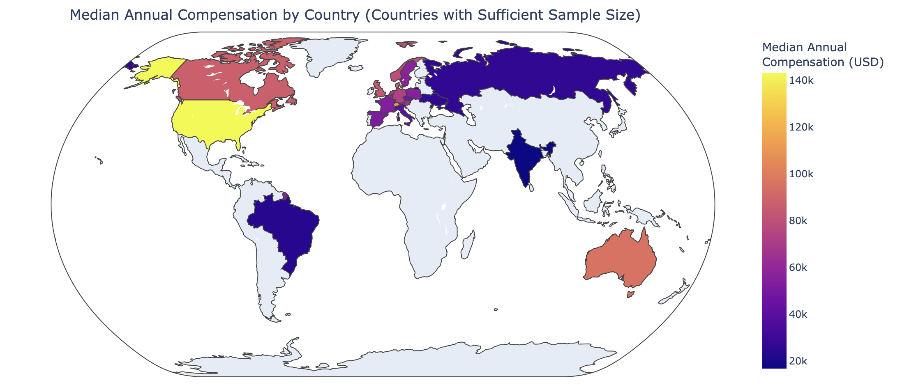
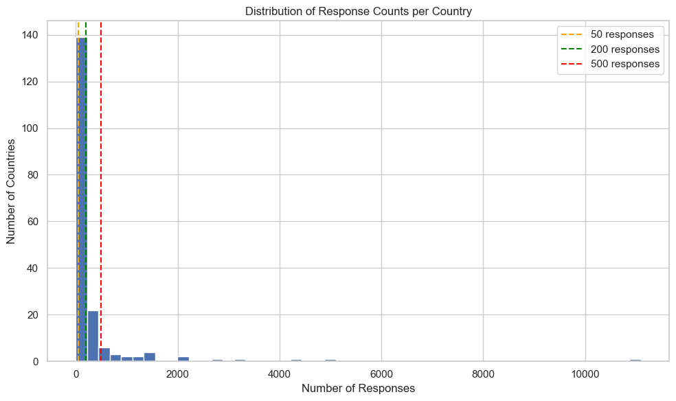
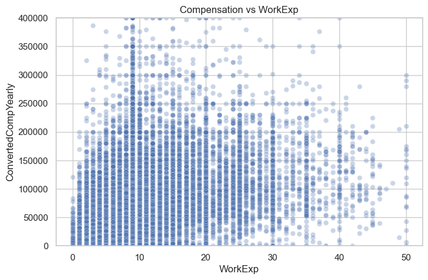

*Image source: Unsplash

Hi there! This time, I explored the data from the annual survey conducted by Stack Overflow (2024 edition), a site used by developers worldwide, to look for developer trends. I'd like to share some of the analysis I worked on as part of Udacity's Data Science program!

---

## What I Wanted to Know from this Analysis (Questions of Interest)

In this analysis, I focused particularly on these three questions:

1.  **What programming languages are commonly used right now?**
2.  **How much do developer salaries differ by country?**
3.  **What characteristics are associated with higher salaries? (Experience? Education?)**

---

## What the Analysis Revealed (Findings)

Let's take a look at what the data showed, along with some graphs!

### 1. Commonly Used Programming Languages

First, here are the top 10 programming languages that developers reported using professionally in the past year.

*Graph 1: Top 10 Most Commonly Used Programming Languages*

As expected, **JavaScript** remains incredibly popular, likely because it's essential for building interactive websites and web applications. **SQL**, used for managing databases, and **HTML/CSS**, the building blocks of web pages, are also right at the top, reinforcing the importance of web technologies. **Python**'s high ranking reflects its versatility, being widely used not just in web development but also significantly in data science, AI, and automation. TypeScript's presence suggests a growing trend towards adding more structure and safety to JavaScript development. Overall, the skills needed for building and managing applications on the web and working with data appear to be in high demand.

### 2. Salary Differences by Country

Next, let's look at the median annual salary (the typical salary value) by country on a world map. (Note: To make comparisons more reliable, countries with very few survey responses were excluded).

*Graph 2: Median Annual Compensation by Country (Darker color means higher)*

The map clearly shows significant differences across the globe. Salaries tend to be noticeably higher in countries like the **United States**, **Switzerland**, and **Israel** compared to others shown, such as **India**, **Brazil**, or **Ukraine**. This geographic pattern, with North America, Western Europe, and Oceania generally showing higher compensation, might be influenced by factors like the cost of living, the maturity and size of the local tech industry, or the specific types of development roles prevalent in those regions.

*(Optional: Add a screenshot of the boxplot and mention the variation)*

*Graph 3: Annual Compensation Distribution for Key Countries (Box Plot)*

Looking closer at the distribution with a box plot (Graph 3), we can also see that the *range* of salaries (from lower earners to higher earners within the same country) varies significantly. Some countries have a very wide spread, while others are more compressed. This indicates that even within a country, compensation isn't uniform.

### 3. Factors Related to Higher Salaries

Finally, I explored what factors might be related to higher salaries. One of the clearest relationships was between years of professional coding experience and compensation.

*Graph 4: Relationship between Years of Professional Experience and Annual Compensation (Scatter Plot)*

Looking at this graph (Graph 4), we can see a clear upward trend: generally, **developers with more years of professional experience tend to earn higher annual salaries**. This makes intuitive sense, as experience often correlates with increased skills, responsibility, and value to employers.

However, the graph also shows a lot of variation. Notice how for any given number of years of experience, there's a wide range of salaries. This tells us that while experience is important, it's definitely not the only factor determining pay.

**Trying to combine factors like experience, country, and education to understand their collective impact proved challenging.** Further analysis suggested that predicting salary precisely is quite difficult. This implies that many other elements play a crucial role in determining a developer's compensation. These could include:
*   **Specific technical skills:** Proficiency in high-demand languages or specialized tools.
*   **Company factors:** The size, industry, and financial health of the employer.
*   **Role and responsibilities:** Management duties, level of seniority, specific project impact.
*   **Location specifics:** Beyond just the country, the specific city or region's cost of living and job market.
*   **Individual factors:** Negotiation skills, educational background details, portfolio quality, etc.

In short, while experience matters, a developer's salary seems to be the result of a complex mix of many different variables.

---

## Conclusion

*   **Web and data-related programming languages** like JavaScript, SQL, HTML/CSS, and Python are currently very popular among developers.
*   There are **significant global disparities in developer salaries**, with countries like the US and Switzerland generally offering higher compensation than many others, likely influenced by local economic factors.
*   **Years of professional experience is a strong indicator of higher salary**, but it's far from the whole story; many other factors contribute to the wide variation observed.

Overall, the developer landscape is dynamic, and while we can spot clear trends in technology use and compensation drivers like experience and location, individual salary determination remains a complex interplay of various factors.

Data analysis is interesting! I look forward to exploring more data in the future.

*(Optional: Link to the project repository)*
You can find the detailed analysis code (including the models attempted) on the [GitHub repository](https://github.com/keadachik/udacity-dsblogpost).

---
